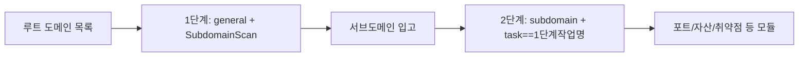

---

## name: scopesentry-mcp
description: ScopeSentry MCP 를 통해 보안 스캔 플랫폼(프로젝트·작업·템플릿·자산·노드)을 관리한다. 사용자가 ScopeSentry, MCP, API Key, 스캔 작업, 자산 조회를 언급할 때 사용한다.

# ScopeSentry MCP 사용 가이드

**이미 배포된 ScopeSentry 인스턴스**를 쓰는 사용자용입니다. Cursor(또는 다른 MCP 클라이언트)로 플랫폼에 연결하며, 로컬 소스 코드는 필요 없습니다.

## 1. 준비 작업

### 1.1 서비스 접근 확인

- 기본 웹 인터페이스: `http://<호스트>`
- MCP 엔드포인트: `http://<호스트>/mcp` (앞단에 리버스 프록시나 프런트엔드 프록시가 있으면 실제 `/mcp` 주소를 기준으로)

### 1.2 API Key 생성

1. 브라우저로 ScopeSentry 웹 인터페이스에 로그인
2. **API Key** 관리 페이지에서 키 생성(또는 관리자가 제공한 인터페이스로 생성)
3. 반환된 `ssk_...` 문자열을 저장(**한 번만 표시됨**)

### 1.3 Cursor MCP 설정

Cursor → Settings → MCP → 서버 추가:

```json
{
  "mcpServers": {
    "scopesentry": {
      "url": "http://<당신의호스트>:8082/mcp",
      "headers": {
        "X-API-Key": "ssk_당신의키"
      }
    }
  }
}
```

`Authorization: Bearer ssk_당신의키` 형식도 사용 가능합니다.

설정 후 MCP 를 재시작하거나 Cursor 를 다시 로드하여, 도구 목록에 `list_projects`, `list_assets` 등이 나타나는지 확인합니다.

---

## 2. 도구 한눈에 보기


| 도구                     | 용도                |
| ---------------------- | ----------------- |
| `list_projects`        | 태그별로 묶인 프로젝트 트리(프로젝트 ID 포함) |
| `list_projects_data`   | 페이지네이션 프로젝트 목록, 이름으로 검색 가능 |
| `get_project`          | 프로젝트 상세              |
| `create_project`       | 프로젝트 생성              |
| `list_tasks`           | 스캔 작업 목록            |
| `get_task`             | 작업 상세              |
| `list_scan_templates`  | 스캔 템플릿 목록            |
| `get_scan_template`    | 템플릿 상세              |
| `list_plugin_modules`  | 스캔 파이프라인 모듈명          |
| `list_plugins`         | 사용 가능한 플러그인(hash·기본 파라미터 포함) |
| `create_scan_template` | 스캔 템플릿 생성            |
| `create_scan_task`     | 스캔 작업 생성            |
| `list_assets`          | 각종 자산 조회(페이지네이션 목록)       |
| `count_assets`         | 자산 개수 집계(`/api/assets/common/total`) |
| `get_asset_detail`     | 자산 또는 취약점 상세           |
| `add_asset_tag`        | 자산에 태그 추가           |
| `list_nodes`           | 스캔 노드 목록            |


각 도구의 파라미터는 MCP 도구 설명(schema)을 기준으로 합니다. `list_assets` / `count_assets` 의 search·filter 문법은 동일하므로, 자산을 조회하기 전에 `list_assets` description 을 먼저 읽어도 됩니다.

「총 몇 건인지」 알아야 할 때는 `count_assets`(웹 페이지네이션 총개수 인터페이스에 대응)를 쓰고, 총개수를 세려고 `list_assets` 를 반복해서 넘기지 않습니다.

---

## 3. 자주 쓰는 워크플로

### 3.1 프로젝트별 자산 조회

사용자나 컨텍스트에 **이미 프로젝트 조건이 있을 때**는 `filter.project` 를 우선 붙여 범위를 좁혀, 프로젝트 간 데이터가 너무 많아 응답이 느려지는 것을 피합니다. 명확한 프로젝트가 없으면 프로젝트 필터를 강제하지 않아도 됩니다.

1. `list_projects` 또는 `list_projects_data` 로 대상 프로젝트의 **ObjectID**(`id` / `children[].value`)를 얻기
2. `list_assets` 에 `filter.project` 전달(**반드시 ID, 프로젝트 한글/표시명을 쓰면 안 됨**)

```json
{
  "asset_type": "asset",
  "pageIndex": 1,
  "pageSize": 20,
  "search": "domain=^example.com",
  "filter": {
    "project": ["<프로젝트ObjectID>"]
  }
}
```

### 3.2 스캔 작업 생성

1. `list_nodes` 로 온라인 노드 이름 얻기
2. `list_scan_templates` 또는 `create_scan_template` 로 템플릿 **ObjectID** 얻기
3. `create_scan_task`: `name`, `node` 필수, `template` 에는 템플릿 ID 입력(템플릿 이름 불가)

**대상 소스 `targetSource`(웹 쪽과 동일):**

| targetSource | 설명 | 필수 파라미터 |
| --- | --- | --- |
| `general` | 대상을 직접 입력 | `target` |
| `project` | 프로젝트에서 대상 읽기 | `project`(프로젝트 ObjectID 배열) |
| `asset` | 웹 자산 라이브러리에서 검색 | `search`; 선택 `project`·`filter`·`targetNumber` |
| `RootDomain` | 루트 도메인 라이브러리에서 검색 | `search`; 선택 `project`·`filter`·`targetNumber` |
| `subdomain` | 서브도메인 라이브러리에서 검색 | `search`; 선택 `project`·`filter`·`targetNumber` |
| `UrlScan` | URL 스캔 결과에서 검색 | `search`; 선택 `project`·`filter`·`targetNumber` |
| `*Source`(예: `subdomainSource`) | 자산 페이지의 「선택/검색」에서 생성 | `targetTp=search` 면 `search`; `targetTp=select` 면 `targetIds` |

**예시 — 루트 도메인 직접 스캔:**

```json
{
  "name": "example-서브도메인수집",
  "node": ["node-1"],
  "template": "<템플릿ObjectID>",
  "targetSource": "general",
  "target": "example.com\nfoo.com",
  "project": ["<프로젝트ObjectID>"]
}
```

**예시 — 서브도메인 라이브러리에서 이어 스캔(이전 작업명으로 필터):**

```json
{
  "name": "example-포트및취약점",
  "node": ["node-1"],
  "template": "<후속모듈템플릿ObjectID>",
  "targetSource": "subdomain",
  "search": "task==\"example-서브도메인수집\"",
  "project": ["<프로젝트ObjectID>"]
}
```

### 3.3 루트 도메인 전체 정보 수집(2단계 권장)

입력이 **루트 도메인**이고 **전체 정보 수집**을 하려면, 한 번에 전체 파이프라인을 돌리지 말고 두 번에 나눠 스캔하길 권장합니다.

**이유:** 분산 작업은 **단일 대상** 단위로 분배됩니다. 루트 도메인을 대상으로 하면 어떤 노드가 그 루트 도메인을 할당받은 뒤, 그 노드에서 찾아낸 서브도메인도 계속 같은 노드에서 후속 모듈을 수행하므로, 부하 불균형·속도 저하·오류가 생기기 쉽습니다.

**모범 사례:**

1. **1단계 — 서브도메인 수집만**
   - `targetSource`: `general`
   - `target`: 모든 루트 도메인(여러 줄)
   - 템플릿: `SubdomainScan`, `SubdomainSecurity`(서브도메인 스캔 + 서브도메인 테이크오버)만 활성화
   - `get_task` 로 작업 완료 대기

2. **2단계 — 후속 모듈**
   - `targetSource`: `subdomain`
   - `search`: `task=="<1단계 작업 이름>"`(작업명 정확히 일치)
   - 선택적으로 `project` 로 범위 축소
   - 템플릿: 포트 스캔·자산 매핑·취약점 스캔 등(SubdomainScan 은 뺄 수 있음)
   - 서브도메인이 독립 대상으로 각 노드에 분배되어 병렬 효율이 더 높음

웹 인터페이스의 「서브도메인」 자산 페이지에서 작업명으로 필터한 뒤 「서브도메인에서 작업 생성」을 써도 효과는 같습니다.



### 3.4 스캔 템플릿 생성

1. `list_plugin_modules` → 모듈명 목록
2. `list_plugins`(`module` 로 필터 가능) → 각 플러그인의 `hash` 와 기본 `parameter`
3. `create_scan_template`: `modules` 로 「모듈 → 플러그인 hash 배열」 지정

---

## 4. 자산 조회(`list_assets` / `count_assets`)

`count_assets` 는 `list_assets` 와 동일한 `asset_type`·`search`·`filter` 를 쓰며 `{ "total": N }` 을 반환하고, 웹 쪽 `/api/assets/common/total` 에 대응합니다.

```json
{
  "asset_type": "subdomain",
  "search": "task==\"어떤작업명\"",
  "filter": {"project": ["<프로젝트ObjectID>"]}
}
```

**성능 권장(`list_assets` / `count_assets` 공통):** 프로젝트 조건이 있으면 `filter.project` 로 먼저 범위를 좁히고, `search` 에서 인덱스가 걸린 필드에는 되도록 `==` 전체 일치나 `^` 접두 일치를 쓴다(자세히는 [4.3](#43-search-검색-표현식)). 넓은 범위의 `=` 모호 조회로 응답이 느려지는 것을 피한다. 프로젝트 컨텍스트가 없으면 프로젝트 필터를 강제하지 않는다.

`filter.project` 를 지원하는 타입은 [4.4](#44-filter-정확-필터) 표 참조.

### 4.1 자산 타입 `asset_type`

`asset`, `RootDomain`, `subdomain`, `app`, `mp`, `UrlScan`, `SensitiveResult`, `DirScanResult`, `crawler`, `vulnerability`, `PageMonitoring`, `IPAsset`, `SubdomainTakerResult`

별칭 예: `web`→asset, `vuln`→vulnerability, `ip`→IPAsset, `url`→UrlScan

### 4.2 파라미터 설명


| 파라미터                       | 설명                                      |
| ------------------------ | --------------------------------------- |
| `pageIndex` / `pageSize` | 페이지네이션, 기본 1 / 20                            |
| `search`                 | 검색 표현식(아래 절 참조)                              |
| `filter`                 | 정확 필터 JSON(아래 절 참조)                          |
| `sort`                   | UrlScan, DirScanResult 만 `length` 로 정렬 지원 |
| `sid`                    | SensitiveResult 전용: 민감 규칙 이름                |


`search` 와 `filter` 는 **동시에 사용 가능**합니다.

### 4.3 search 검색 표현식

자체 DSL(**SQL 아님**):


| 연산자  | 의미   | 인덱스 | 예시                          |
| ---- | ---- | ---- | --------------------------- |
| `=`  | 모호 일치(regex) | 인덱스 미사용 | `domain=example`            |
| `==` | 정확 일치(전체 일치) | **인덱스 사용** | `port==443`                 |
| `!=` | 제외   | — | `port!="80"`                |
| `&&` | AND  | — | `domain==example.com && port==443` |
| `||` | OR   | — | `title=admin || body=login` |


**인덱스와 연산자:** `domain`, `ip`, `port`, `title` 등 필드는 인덱스가 걸려 있지만, **`==` 전체 일치** 또는 **값이 `^` 로 시작하는 접두 일치**(예: `domain=^example.com`)만 인덱스를 탄다. **`=` 는 regex 모호 일치로 변환되어 인덱스를 못 쓰므로**, 데이터가 많으면 느려지기 쉽다.

**모든 타입 공통 search 필드:** `tag`, `task`(작업명), `rootDomain`

**project 는 search 안에 쓸 수 없음**(무효이거나 `&&` 와 조합 시 에러). 프로젝트로 필터하려면 `filter.project` 를 사용.

**타입별 자주 쓰는 search 필드:**


| asset_type           | 필드                                                                                  |
| -------------------- | ----------------------------------------------------------------------------------- |
| asset                | domain, ip, port, service, app, title, statuscode, icon, banner, type, body, header |
| RootDomain           | domain, icp, company                                                                |
| subdomain            | domain, ip, type, value                                                             |
| app                  | name, icp, company, category, description, url, apk                                 |
| mp                   | name, icp, company, category, description, url                                      |
| UrlScan              | url, input, source, resultId, type                                                  |
| SensitiveResult      | url, sname, body, info, md5                                                         |
| DirScanResult        | url, statuscode, redirect, length                                                   |
| vulnerability        | url, vulname, matched, request, response, level                                     |
| crawler              | url, method, body, resultId                                                         |
| PageMonitoring       | url, hash, diff, response                                                           |
| IPAsset              | ip, domain, port, service, webServer, app                                           |
| SubdomainTakerResult | domain, value, type, response                                                       |


**search 예시:**

- `domain==www.example.com && port==443`(전체 일치, 인덱스 사용)
- `domain=^example.com`(접두 일치, 인덱스 사용)
- `ip==192.168.1.1`
- `task=="어떤작업명"`
- `level==high`(vulnerability)
- `statuscode==200`(DirScanResult)

모호 포함이 필요할 때만 `=` 를 쓴다. 예: `title=admin`(인덱스 미사용, 프로젝트 등 조건과 함께 범위를 좁히는 것이 좋음).

### 4.4 filter 정확 필터

JSON 객체: 같은 key 의 여러 값은 **OR**, 다른 key 끼리는 **AND**.

**프로젝트 조건이 있으면 `project` 우선:** 사용자나 컨텍스트에 프로젝트가 명확하고 asset_type 이 `project` 를 지원하면, 붙여서 범위를 좁힌다. 프로젝트 정보가 없으면 강제하지 않는다.


| filter key   | 의미       | 값 설명                                                     |
| ------------ | -------- | -------------------------------------------------------- |
| `project`    | 소속 프로젝트     | **ObjectID**, `list_projects` / `list_projects_data` 로 획득 |
| `task`       | 출처 작업     | **작업명**, `list_tasks` 의 `name`                         |
| `port`       | 포트       | 예: `"443"`                                                |
| `service`    | 서비스/프로토콜    | 예: `"https"`                                              |
| `app`        | 애플리케이션 지문     | 예: `"Nginx"`                                              |
| `icon`       | 아이콘 hash  |                                                          |
| `statuscode` | HTTP 상태 코드 | 주로 asset 용                                               |
| `status`     | 상태       | UrlScan/DirScan 의 HTTP 코드; 취약점/민감정보 처리 상태                       |
| `level`      | 취약점 등급     | critical / high / medium / low / info                    |
| `type`       | 타입       | 예: 서브도메인 레코드 타입 A, CNAME                                         |
| `color`      | 민감 규칙 색상   | SensitiveResult                                          |
| `sname`      | 민감 규칙명    | SensitiveResult                                          |
| `tags`       | 태그       |                                                          |


**타입별 사용 가능한 filter key:**


| asset_type                            | filter key                                                      |
| ------------------------------------- | --------------------------------------------------------------- |
| asset                                 | project, port, service, app, icon, statuscode, type, task, tags |
| RootDomain                            | project, tags                                                   |
| subdomain                             | project, type, task, tags                                       |
| app / mp                              | project, tags                                                   |
| UrlScan                               | status, tags                                                    |
| DirScanResult                         | status, tags                                                    |
| SensitiveResult                       | status, color, sname, tags                                      |
| crawler                               | project, task, tags                                             |
| vulnerability                         | project, level, status, task, tags                              |
| PageMonitoring / SubdomainTakerResult | tags                                                            |
| IPAsset                               | project, port, service, app                                     |


**filter 예시:**

```json
{"project": ["<프로젝트ObjectID>"], "port": ["443"]}
```

**조합 조회 예시:**

```json
{
  "asset_type": "asset",
  "search": "domain=^baidu && port==443",
  "filter": {"project": ["<프로젝트ObjectID>"]},
  "pageIndex": 1,
  "pageSize": 10
}
```

**주의:**

- 프로젝트 조건이 있으면 `filter.project` 우선(지원 시); 프로젝트 컨텍스트가 없으면 강제하지 않음
- `filter.project` 에 프로젝트 표시명을 넣지 말 것
- 알려진 값은 `==`, 접두는 `^`; 큰 테이블에 `=` 모호 일치 남용 금지
- UrlScan 의 HTTP 상태는 `filter.status`; DirScanResult 는 search 에서 `statuscode==200` 사용 가능
- SensitiveResult 는 규칙명으로: `search` 에 `sname=규칙명`, 또는 `filter.sname`

### 4.5 정렬 sort

**UrlScan**, **DirScanResult** 만 지원:

```json
{"length": "ascending"}
```

다른 타입은 `sort` 를 무시하고 시간순 기본 정렬.

---

## 5. 스캔 템플릿 모듈명

`TargetHandler`, `SubdomainScan`, `SubdomainSecurity`, `PortScanPreparation`, `PortScan`, `PortFingerprint`, `AssetMapping`, `AssetHandle`, `URLScan`, `WebCrawler`, `URLSecurity`, `DirScan`, `VulnerabilityScan`, `PassiveScan`

---

## 6. 문제 해결


| 현상        | 처리                                                 |
| --------- | -------------------------------------------------- |
| MCP 에 도구 없음   | URL·API Key·ScopeSentry 실행 여부 확인                    |
| 401 / 403 | API Key 재생성 또는 교체                                    |
| 자산이 조회 안 됨     | `filter.project` 가 ObjectID 인지 확인; search 에 project 쓰지 말 것 |
| 템플릿/작업 생성 실패 | `template` 은 반드시 템플릿 ObjectID; `node` 는 온라인 노드명 입력            |
| 조회가 매우 느림/멈춤   | 프로젝트가 있으면 `filter.project` 추가; search 는 인덱스 필드에 `==` 나 `^` 접두로, `=` 는 적게; `pageSize` 축소 |


---
